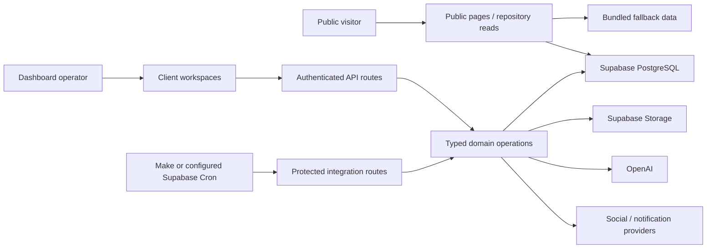

# System architecture and stack

**Status: CURRENT — Alpha v31.1.**

## Runtime

One Next.js App Router application serves the public website, authenticated operations dashboard, API routes and authentication callbacks. React client components call same-application endpoints; server components and handlers use Supabase clients and domain helpers. There is no separate worker service or Supabase Edge Function implementation in this checkout.

## Stack pinned by the current lockfile

| Layer | Current implementation |
| --- | --- |
| Framework / UI | Next.js 16.3.8; React / React DOM 19.3.0 |
| Language | TypeScript 7.0.2; strict checking; `@/*` resolves to `src/*` |
| Styling | Tailwind CSS 3.4.19, PostCSS, global CSS; Lucide icons |
| Data / auth / files | Supabase JS 2.117.2 and SSR 0.12.7; PostgreSQL, Auth cookies and Storage |
| AI | OpenAI SDK 7.28.0; model names are server configuration |
| Image processing | Sharp 0.35.5; current Next Stop poster rendering is delegated to the image model |
| Geography / time | D3 Geo, TopoJSON / US Atlas and Luxon |
| Delivery | Provider adapters for Telegram, X, Instagram and Bluesky; Web Push; Resend HTTP API |

The package manifest uses many `latest` ranges, but [package-lock.json](../package-lock.json) fixes the versions used by `npm ci`. Node must meet Next's `>=20.9.0` requirement. Stripe is installed as a dependency; this checkout has no implemented Stripe checkout/webhook, Shippo or QuickBooks adapter. Do not infer operational integrations from dependencies or historical roadmap text.

## Active source map

| Boundary | Entry points |
| --- | --- |
| Public reads and fallback | [repository.ts](../src/lib/repository.ts), [seed.ts](../src/data/seed.ts), [incident-report.ts](../src/lib/incident-report.ts) |
| Unified Events | [dashboard/events](../src/app/dashboard/events/page.tsx), [UnifiedEventsPage](../src/components/alpha92/UnifiedEventsPage.tsx), [event lifecycle](../src/lib/alpha92/event-lifecycle.ts) |
| Deployment Ops | [con-prep layout](../src/app/dashboard/con-prep/layout.tsx), [Alpha8ConventionWorkspace](../src/components/alpha8/Alpha8ConventionWorkspace.tsx), [workspace records](../src/lib/alpha8/workspace-records.ts) |
| Reusable media | [MediaLibraryPage](../src/components/media/MediaLibraryPage.tsx), [media API](../src/app/api/alpha91/media/route.ts) |
| Auth / privileged data | [auth.ts](../src/lib/auth.ts), [Supabase clients](../src/lib/supabase/server.ts), [Alpha7 auth](../src/lib/alpha7/auth.ts) |
| Public plans / reports | [deployment detail](../src/app/deployments/[slug]/page.tsx), [archive](../src/lib/deployment-archive.ts) |
| Background work | [automation tick](../src/app/api/integrations/automation/tick/route.ts), [cron activation SQL](../supabase/ALPHA_V31_ENABLE_SUPABASE_CRON_AFTER_DEPLOY.sql) |

`/dashboard/con-prep`'s layout renders the Alpha8 workspace and ignores child page content. Earlier `ConOpsManager` and `ConventionDeployment` components remain in the repository; their presence does not identify the active workspace. API prefixes such as `alpha7`, `alpha8`, `alpha91` and `alpha92` coexist in the current release and describe incremental implementation generations.

## Data and trust boundaries

Public repository reads use publishable/anonymous credentials and published/active filters, often falling back to seeded content on absent configuration or unsuccessful queries. Some public detail endpoints use the server credential and enforce filters themselves. Successful public rendering therefore does not prove database connectivity or that private rows cannot leak through a different path.

Dashboard APIs generally use server credentials after application authentication. PostgreSQL triggers recalculate readiness and lifecycle; the application also contains legacy readiness writers. Remote automation is an HTTP invocation of the Next application, not a process that starts automatically with `npm run dev`.

Alpha is an operator-focused system. Ownership columns prepare some records for future multi-profile use; they do not establish complete tenant isolation. See [data model](data-model.md), [security](security.md) and the feature pages for exact boundaries and known discrepancies.
