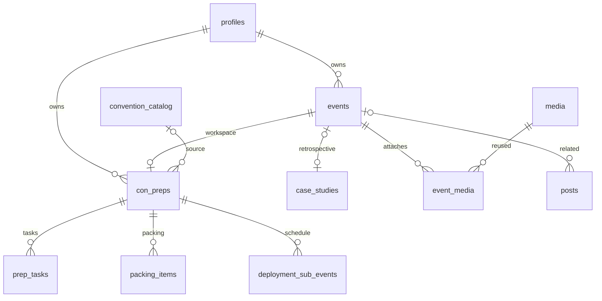

# Data model

This describes the checked-in Alpha v31.1 application and SQL, not a verified inventory of a hosted Supabase project. The application version comes from [`app-version.ts`](../src/lib/app-version.ts); the package manifest still uses an older version. Planned directory changes are in the [Alpha v31.2 specification](product-specs/alpha-v31.2-convention-directory.md).

## Core records

| Record | Purpose and relationships | Source |
| --- | --- | --- |
| `profiles` | One row per `auth.users.id`; role is `viewer`, `editor`, or `admin`. Many later ownership columns reference this row. | [`schema.sql`](../supabase/schema.sql), [`profiles.ts`](../src/lib/profiles.ts) |
| `events` | Dated occurrence with unique public `slug`, title, start/end, location/geography, publication flag, event type and quarter. Later columns add owner, tags, suiting and Next Stop state. | [`event-records.ts`](../src/lib/event-records.ts), [`schema.sql`](../supabase/schema.sql) |
| `con_preps` | Operational deployment workspace; `event_id` is required and unique, so an event has at most one workspace. Includes timing, status, owner, optional catalog link and stored readiness. | [`schema.sql`](../supabase/schema.sql), [v31 SQL](../supabase/ALPHA_V31_DEPLOYMENT_AUTOMATION_RUN_THIS.sql) |
| `convention_catalog` | Reusable source entry with `slug`/`series_slug`, source authority, attendance ranking, location and current announced dates. Linked through `con_preps.catalog_id`. | [v26 foundation](../supabase/migrations/20260923_v26_alpha_chaos_ops.sql), [`catalog.ts`](../src/lib/conventions/catalog.ts) |
| `case_studies` | Retrospective narrative, hero URL, free-text status and publication fields. Nullable `event_id`; Alpha 9.2 adds uniqueness for non-null event associations. | [incident-report migration](../supabase/migrations/20260927_event_incident_reports.sql), [Alpha 9.2 SQL](../supabase/V26_ALPHA92_UNIFIED_EVENT_LIFECYCLE_RUN_THIS.sql) |
| `media` | Reusable image/video asset with URL/storage path, caption, owner, tags and favorite flag. Legacy `event_id` remains. | [`schema.sql`](../supabase/schema.sql), [Alpha 9.1 SQL](../supabase/V26_ALPHA91_MEDIA_TAGS_FIX_RUN_THIS.sql) |
| `event_media` | Many-to-many event/asset attachment with unique `(event_id, media_id)`, caption override, display order and featured flag. | [Alpha 9.2 SQL](../supabase/V26_ALPHA92_UNIFIED_EVENT_LIFECYCLE_RUN_THIS.sql) |

An **Event** is the dated record; a **Deployment** is its `con_preps` operational workspace; a **Tactical Deployment Plan** or **Case Study** is a public presentation of that event. These names do not identify three separate copies of the same event.

Optional ownership and legacy orphan case studies are simplified in this diagram; consult the SQL for nullability and deletion behavior.

## Deployment children and reusable defaults

| Tables | Model |
| --- | --- |
| `packing_items` | Workspace children; `parent_item_id` forms nested kits. Stores quantity, packed state, required flag, source and order. |
| `prep_tasks` | Workspace children; `parent_task_id` forms nested tasks. Stores status, due/scheduled times, duration, relative departure offset and `counts_toward_readiness`. |
| `travel_segments`, `hotel_stays` | Workspace children containing travel/lodging details, confirmations and optional costs. Travel retains flight/car/other kinds and direction/car mode. |
| `con_registrations` | At most one badge/registration row per workspace; needed/ordered/paid/confirmed status. |
| `cost_entries` | Ledger with optional workspace and event links, amount in cents, currency, external key, owner and cost status. Alpha 9 changes states to `unbudgeted`, `budgeted`, `paid`. |
| `deployment_sub_events` | Scheduled appearances/activities with required workspace link and optional event link, owner, attendance, inherited/explicit suiting, public/Next Stop flags and reminder settings. |
| `loadout_templates`, `loadout_template_items` | Global or owned packing defaults; nested template items are copied into workspace packing rows. |
| `prep_task_templates`, `prep_task_template_items` | Global or owned action/task defaults; separate from physical packing loadouts. |
| `operator_preferences` | One row per profile; timezone, work/printing JSON, travel buffers, sticker rate and default loadouts. |
| `availability_windows`, `weekly_work_blocks`, `schedule_overrides`, `site_settings` | Shared scheduling windows, weekly work, dated exceptions and application settings. |

Sources: [`schema.sql`](../supabase/schema.sql), [Alpha 9 timeline SQL](../supabase/V26_ALPHA9_DEPLOYMENT_TIMELINE_RUN_THIS.sql), [`workspace-records.ts`](../src/lib/alpha8/workspace-records.ts), [`scheduling.ts`](../src/lib/scheduling.ts).

Current records do **not** include normalized `convention_series`, `convention_editions`, or attendance-history tables. `convention_catalog.series_slug` and year-bearing `events.slug` provide the current series/occurrence convention. Future series/edition/attendance entities in the v31.2 specification must not be mistaken for deployed tables.

## Other subsystems

| Tables | Relationship and responsibility |
| --- | --- |
| `posts`, `post_media`, `post_platforms`, `post_metrics` | Optional event association, reusable asset joins, one platform destination per post, and successive destination metric snapshots. |
| `social_provider_connections` | Per-auth-user OAuth provider connection; encrypted token payloads and connection metadata. Server access only. |
| `notifications`, `notification_deliveries` | Per-user notification with optional event/post/order links; one queued delivery per notification/channel. |
| `notification_preferences`, `notification_topic_preferences`, `push_subscriptions` | Per-auth-user routing settings and browser push registrations. |
| `copilot_threads`, `copilot_messages`, `copilot_actions` | User-owned conversation context, ordered messages, and proposed actions with explicit state/risk/payload/result. Threads can link deployments, events and posts. |
| `copilot_attachments`, `security_grants` | Private extraction source files/context and hashed, expiring step-up grants. Alpha 7 also adds event/attachment links to actions. |
| `event_generated_assets` | Owned event render history; event columns hold current poster/background pointers, hashes, copy, prompts and validation state. |
| `brand_assets`, `user_brand_settings` | User-owned private reference assets and selected mascot/logo settings. |
| `products`, `product_variants`, `print_quotes`, `orders` | Catalog/variant records, print inquiry intake and order snapshots. Stripe IDs exist as fields; they do not by themselves establish checkout implementation. |
| `projects`, `social_links` | Public published project content and active social profile links. |

Source definitions live in [`schema.sql`](../supabase/schema.sql), [Alpha 7 complete SQL](../supabase/V26_ALPHA7_COMPLETE_RUN_THIS.sql), [brand-assets SQL](../supabase/V26_ALPHA71_BRAND_ASSETS_RUN_THIS.sql), and [v30 render SQL](../supabase/ALPHA_V30_NEXT_STOP_AI_RENDER_RUN_THIS.sql). Feature documents describe the corresponding application behavior.

## Ownership, RLS and storage

- Base RLS permits public reads of published events/projects/case studies/media and active social links/products/variants; profiles and notification preferences/subscriptions have selected own-user read policies.
- Operations, AI, generated assets, provider connections, brand assets and `event_media` enable RLS without general browser write policies. Server clients use the Supabase secret/service-role key after application authorization.
- Owner columns are nullable on many legacy records. Modern event/workspace helpers accept records owned by the current user **or without an owner**; this is Alpha compatibility, not complete multi-tenant isolation.
- The general dashboard role gate and Alpha API email gate differ. [`auth.ts`](../src/lib/auth.ts) checks an allowlisted email or editor/admin profile; [`alpha7/auth.ts`](../src/lib/alpha7/auth.ts) accepts an authenticated user when the configured email allowlist is empty. See [security](security.md).
- `event_media` has no owner column; its API checks event ownership and, on attach, media ownership. Server-role queries bypass RLS, so individual route checks matter.
- Event deletion cascades its workspace, workspace children, generated assets and attachment joins; case studies, legacy media and posts instead retain records with nullable event references. Owner deletion can set legacy ownership to null.
- SQL creates public `public-media` and `next-stop-assets` buckets, and private `copilot-attachments` and `dusk-brand-assets` buckets. A row's `published` flag is not an access barrier for an already public storage URL.

## SQL chronology and boundaries

The files are historical schema layers, not an interchangeable set of fresh installs. [`schema.sql`](../supabase/schema.sql) embeds the base schema and many earlier upgrades through v26 Alpha 3; it does not include the complete Alpha v31.1 model. See [setup](setup.md) before choosing a deployment sequence.

| Layer | Checked-in additions |
| --- | --- |
| [September 20–28 migrations](../supabase/migrations) | Auth/geography; operations/social; scheduling; travel/costs; notifications; event retrospectives; v26 catalog/AI/templates and social providers. Some are already embedded in `schema.sql`. |
| [October 1 Alpha 7](../supabase/migrations/20261001_v26_alpha7_next_stop_generator.sql), [complete wrapper](../supabase/V26_ALPHA7_COMPLETE_RUN_THIS.sql) | Next Stop event fields/history; complete wrapper additionally supplies missing AI attachment/record-action foundation. |
| [Alpha 7.1](../supabase/V26_ALPHA71_BRAND_ASSETS_RUN_THIS.sql), [7.2](../supabase/V26_ALPHA72_BACKGROUND_REUSE_RUN_THIS.sql) | Brand asset tables and reusable background state. |
| [Alpha 8.1](../supabase/V26_ALPHA81_DIRECT_EDITING_RUN_THIS.sql) | Child-row `updated_at` fields and `dusk_set_updated_at()` helper. |
| [Alpha 9](../supabase/V26_ALPHA9_DEPLOYMENT_TIMELINE_RUN_THIS.sql), [9.1](../supabase/V26_ALPHA91_MEDIA_TAGS_FIX_RUN_THIS.sql), [9.2](../supabase/V26_ALPHA92_UNIFIED_EVENT_LIFECYCLE_RUN_THIS.sql) | Sub-events/budget semantics; tag synchronization/media library; one case study per event and reusable attachments. |
| [Alpha v30](../supabase/ALPHA_V30_NEXT_STOP_AI_RENDER_RUN_THIS.sql) | AI wording/validation fields and background history asset type; marks existing posters stale. |
| [Alpha v31](../supabase/ALPHA_V31_DEPLOYMENT_AUTOMATION_RUN_THIS.sql) | Stored weighted readiness, planning/packing/traveling/complete lifecycle, child triggers, sweep and case-study creation. |
| [Alpha v31.1](../supabase/ALPHA_V31_1_SECURITY_HOTFIX_RUN_THIS.sql) | Pins helper search paths and restricts direct execution to service role; requires prior helpers to exist. |
| [Post-deploy cron](../supabase/ALPHA_V31_ENABLE_SUPABASE_CRON_AFTER_DEPLOY.sql) | Separate production HTTP schedule using pg_cron, pg_net and Vault; not application table installation. |

The v26 foundation wrapper is not a whole-project schema. Files with ` 2` suffixes are historical copies, not an extra release stage. Date ordering alone is insufficient: migrations refer to existing tables, later files change enum-like constraints, and some SQL also updates specific FurPocalypse records/default settings.

## Known source limits

- The Social Review tail of `schema.sql` and [`20260924_v26_alpha5_social_review.sql`](../supabase/migrations/20260924_v26_alpha5_social_review.sql) contain literal `\n` text inside a SQL comment rather than executable multiline statements. Do not infer that every named section ran.
- Alpha 9.2 adds a partial unique index on `case_studies(event_id) WHERE event_id IS NOT NULL`. The v31 creation helper uses `ON CONFLICT (event_id)` without that predicate; with only the repository-defined indexes, PostgreSQL cannot infer that conflict target. A deployed full unique index could change the outcome; hosted indexes have not been verified.
- `eventRowToItem()` maps a smaller legacy public event shape and drops structured tags, owner, suiting and render metadata. Public archive media counts still use `media.event_id`; detail pages prefer `event_media`.
- Stored readiness and completion are database functions when v31 SQL is installed. Legacy application computations also exist and can disagree; see [events and deployments](features/events-deployments.md), [readiness/lifecycle](features/readiness-lifecycle.md), and [operations](features/deployment-ops.md).
